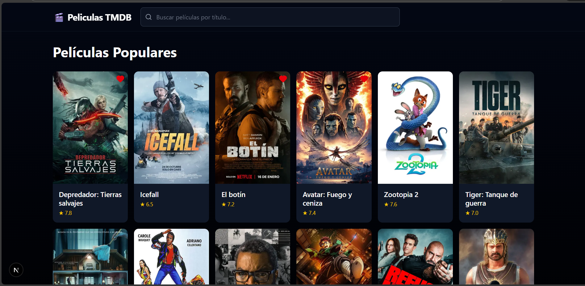
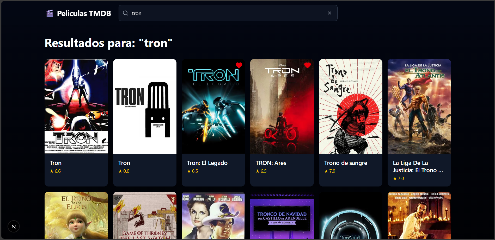
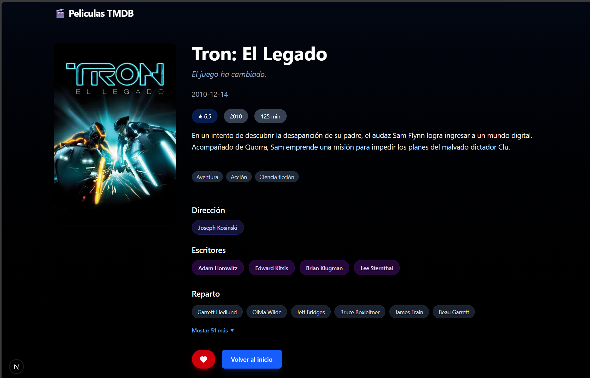

# Peliculas TMDB

## Demo 
Prueba la aplicación aquí:
https://peliculas-tmdb-chi.vercel.app/

Una aplicación web moderna construida con **Next.js 16**, **TypeScript** y **Tailwind CSS** para explorar películas populares y buscar títulos específicos usando la API de **The Movie Database (TMDB)**.

## Características principales

- Explora películas populares con paginación infinita 
- Busqueda en tiempo reañ con **debounce**
- Diseño escuro, responsivo y moderno 
- API key segura
- Botón de "Me gusta"
- Totalmente responsivo
- Optimizado con Suspense, Image de Next.js y relvalidación inteligente

## Tecnologías utilizadas

- **Next.js 16** (App Router)
- **TypeScript**
- **Tailwind CSS** + **PostCSS**
- **React** + **Hooks** (useState, useEffect, useDebounce)
- **Lucide React** (iconos)
- **TMDB API** (datos de películas)
- **localStorage** (favoritos)

## Instalación y ejecución

1. Clona el repositorio:
```bash
git clone https://github.com/DiegoRT-dev/peliculas-tmdb.git
cd peliculas-tmdb
```

2. Instala las dependencias:
```bash
npm install
# o yarn install / pnpm install
```

3. Crea el archivo .env.local en la raíz con tu clave de TMDB:
```bash
TMDB_API_KEY=tu_clave_de_tmdb_aqui
```

4. Inicia el servidor de desarrollo:
```bash
npm run dev
```

5. Abre en tu navegador:
http://localhost:3000

## Capturas de pantalla

Página principal (películas populares + búsqueda)



Resultados de búsqueda



Detalles de película



## Estructura del proyecto
```bash
app/
├── api/
│   └── movies/
│       └── route.ts          # API segura para TMDB
├── movie/
│   └── [id]/
│       └── page.tsx          # Página de detalles dinámica
├── layout.tsx
├── page.tsx                  # Home con lista y búsqueda
├── loading.tsx               # Pantalla de carga
└── not-found.tsx             # Página 404

components/
├── ActorList.tsx
├── Footer.tsx
├── Header.tsx
├── LikeButton.tsx
├── MovieCard.tsx
├── MovieList.tsx
└── SearchBar.tsx + Wrapper

lib/
└── tmdb.ts                   # Funciones API + tipos
```

## Contribuciones

¡Las contribuciones son bienvenidas! Si encuentras un bug o tienes una idea para mejorar la app, abre un issue o un pull request.

## Licencia

MIT License - siéntete libre de usar, modificar y compartir este proyecto.
Creado con por DiegoRT-dev

¡Gracias por visitar!
